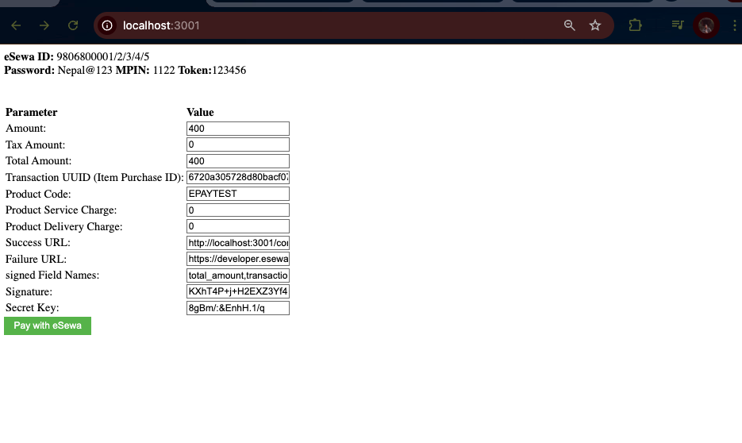
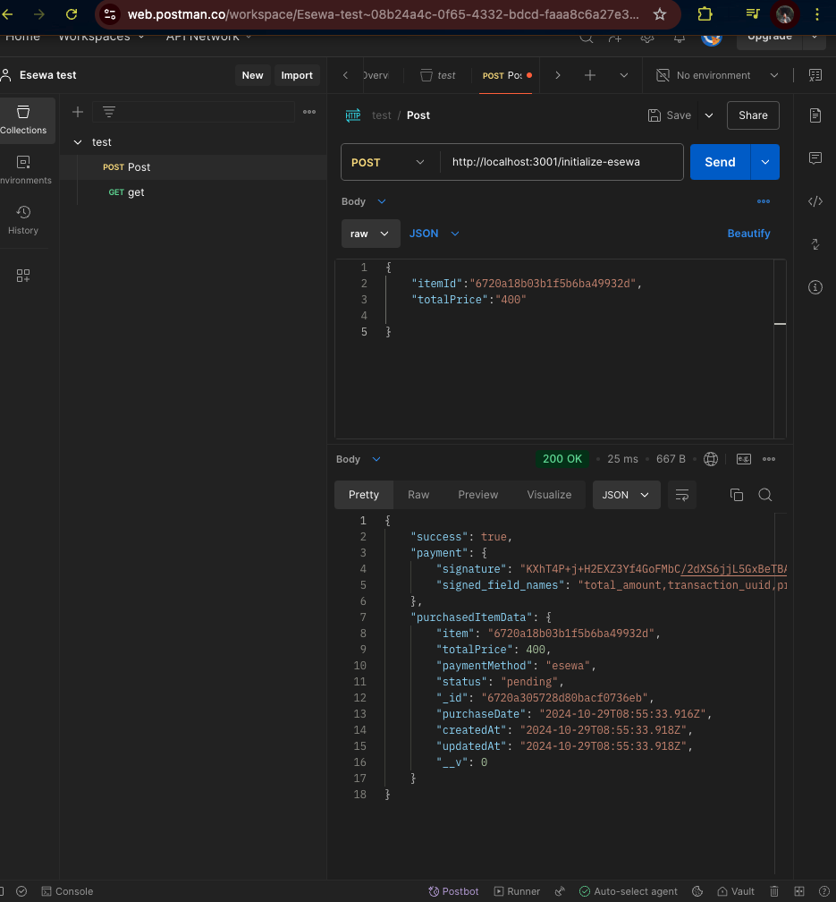
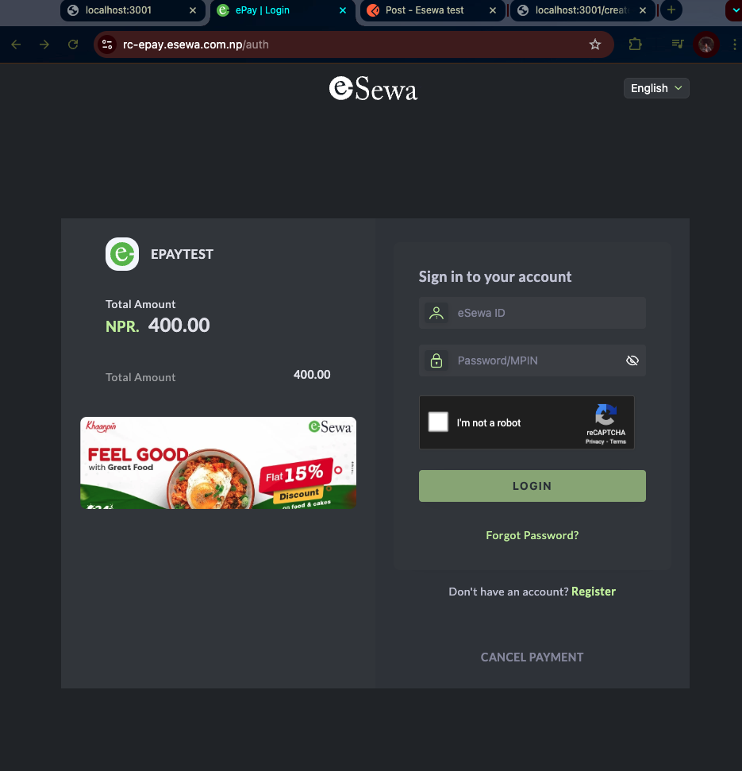

# eSewa-ePay-V2-Payment-Gateway-

This repository provides a basic example of integrating the eSewa Payment Gateway for learning and practice. This guide demonstrates how to initiate payments, verify transactions, and handle responses from eSewa's API.

## Table of Contents

- [Prerequisites](#prerequisites)
- [Setup](#setup)
- [Configuration](#configuration)
- [Usage](#usage)
- [Testing](#testing)
- [Disclaimer](#disclaimer)

## Prerequisites

- An **eSewa merchant account** (or sandbox account for testing)
- Basic knowledge of **HTTP requests** and **callback URLs**

